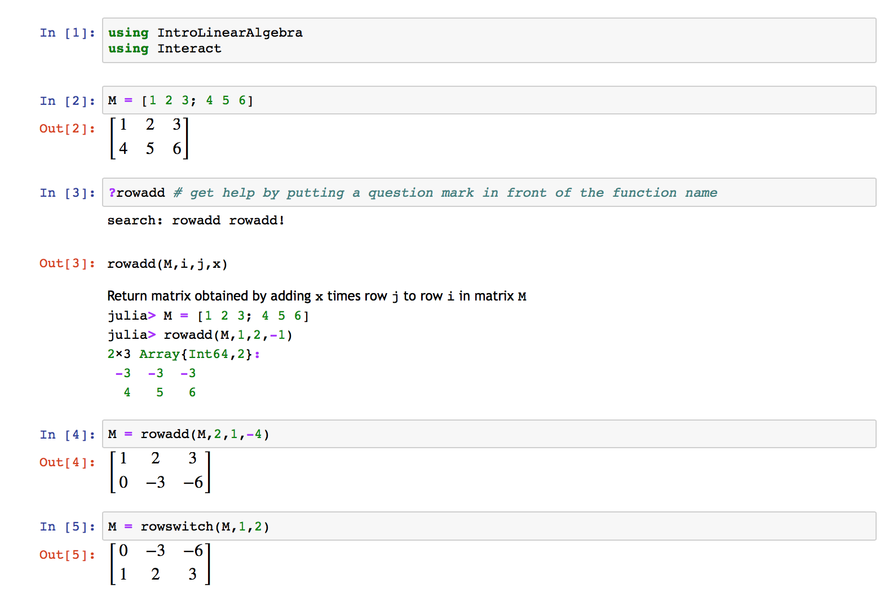
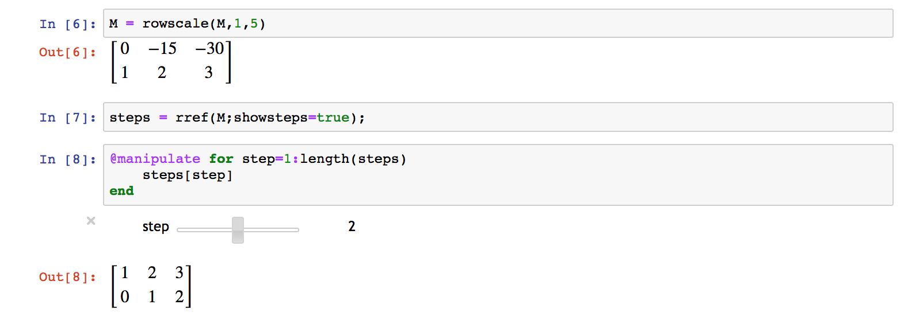

# Computation Resources for Linear Algebra Students

I have made a package in [Julia](http://julialang.org) to help ease some of the more computationally tedious aspects of the course. Your use of this resource is optional, but I have attempted to make it as convenient as possible.

1.  Go to [JuliaBox](http://juliabox.com) and login (you can use Google credentials, such as your Brown login)
2.  Select "Julia 0.5.0" from the "New" pulldown menu in the top right
3.  Type `Pkg.clone("git://github.com/sswatson/IntroLinearAlgebra.jl.git")` into the first cell and type shift+enter to run it
4.  In the second cell type `using IntroLinearAlgebra` and type shift+enter to run it
5.  You're good to go! You can check out this [tutorial notebook](IntroLinearAlgebra_Tutorial.html) for examples you can copy and paste to get started. I have checked that that whole notebook runs smoothly on a fresh JuliaBox session. Since it intermingles installation with calculation; [here's](IntroLinearAlgebra_Example.html) a cleaner one showing a example session after you have everything installed.

If you don't want to have to visit juliabox.com, Julia is easy to [install](http://julialang.org/downloads/) on your own computer. You'll also want to install the notebook interface [IJulia](https://github.com/JuliaLang/IJulia.jl), which is a bit less trivial but still doable. IJulia will still run in your browser, but it won't be connecting to the internet (the content is served on your own machine).

